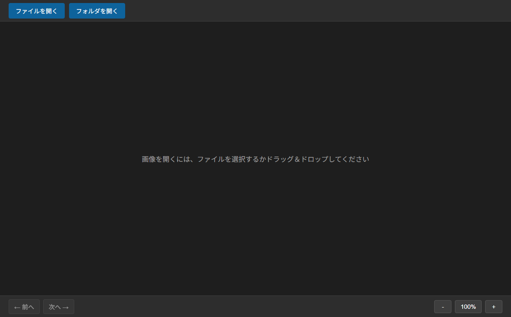

# Image Viewer

[](https://github.com/MSHT0511/image-viewer/actions/workflows/test.yml)
[](https://opensource.org/licenses/MIT)
[](https://github.com/MSHT0511/image-viewer/releases)
[](https://www.electronjs.org/)

Windows/macOS対応のシンプルな画像ビューワーアプリケーション

## 特徴

- 🖼️ **多様な画像フォーマット対応**  
  JPEG、PNG、GIF、BMP、WebP、TIFF、ICO、AVIFに対応

- 🎯 **直感的な操作**  
  ドラッグ&ドロップで画像を簡単に開ける

- 🔍 **高度なズーム機能**  
  マウスホイールでズーム、マウス位置を中心にした拡大・縮小、ドラッグでパン操作

- 📁 **フォルダ対応**  
  フォルダ全体を読み込み、順次画像を閲覧可能

- ⌨️ **キーボードショートカット**  
  効率的な画像閲覧のための豊富なショートカット

- 🖥️ **クロスプラットフォーム**  
  Windows、macOSで動作

## スクリーンショット



*Image Viewerの初期画面。シンプルで直感的なユーザーインターフェイス*

## インストール

### ダウンロード

[Releases](https://github.com/MSHT0511/image-viewer/releases)ページから最新版をダウンロードしてください。

### 開発環境でのビルド

```bash
# リポジトリをクローン
git clone https://github.com/MSHT0511/image-viewer.git
cd image-viewer

# 依存関係をインストール
npm install

# 開発モードで起動
npm start

# 実行可能ファイルを生成
npm run make
```

## 使い方

### 画像を開く

以下の3つの方法で画像を開けます：

1. **ファイルから開く**: `Ctrl/Cmd + O`でファイル選択ダイアログを開く
2. **フォルダから開く**: `Ctrl/Cmd + Shift + O`でフォルダ内の画像を一括読み込み
3. **ドラッグ&ドロップ**: ウィンドウに画像ファイルまたはフォルダをドロップ

### ズーム操作

- **マウスホイール**: 上下でズームイン/アウト
- **ダブルクリック**: ズームをリセット（等倍表示）
- **ドラッグ**: ズーム時に画像をパン（移動）

### ナビゲーション

フォルダ内の複数画像を開いた場合、画面下部のナビゲーションコントロールまたはキーボードで前後の画像に移動できます。

## キーボードショートカット

| ショートカット | 機能 |
|---|---|
| `←` / `→` | 前の画像 / 次の画像 |
| `Space` | 次の画像 |
| `+` / `-` | ズームイン / ズームアウト |
| `Ctrl/Cmd + 0` | ズームリセット |
| `Ctrl/Cmd + O` | ファイルを開く |
| `Ctrl/Cmd + Shift + O` | フォルダを開く |

## 技術スタック

- **Electron**: デスクトップアプリケーションフレームワーク
- **React**: UIフレームワーク
- **TypeScript**: プログラミング言語
- **Vite**: ビルドツール
- **Playwright**: E2Eテスト

## 開発

### 必要な環境

- Node.js 18以上
- npm 9以上

### スクリプト

```bash
# 開発モードで起動
npm start

# ビルド（パッケージ化）
npm run make

# ユニットテスト実行
npm run test:unit

# カバレッジ付きテスト実行
npm run test:coverage

# E2Eテスト実行
npm run test:e2e

# 全テスト実行（ユニット + E2E）
npm run test:all

# E2EテストをUIモードで実行
npm run test:ui

# E2Eテストをheadedモードで実行
npm run test:headed

# E2Eテストをデバッグモードで実行
npm run test:debug
```

## テスト

このプロジェクトは包括的なテストスイートを備えています：

### ユニットテスト
- **カバレッジ**: 84%+
- **テストフレームワーク**: Vitest
- **テスト対象**:
  - Reactコンポーネント（Toolbar、ImageViewer、NavigationControlsなど）
  - カスタムフック（useZoom、useImageList、useKeyboardShortcutsなど）
  - ユーティリティ関数（TIFFコンバーターなど）
  - メインプロセスロジック（ファイルI/O、IPCハンドラー）

### E2Eテスト
- **テストフレームワーク**: Playwright
- **テストシナリオ**:
  - 画像読み込み（JPEG、PNG、GIF、WebP、TIFF）
  - ナビゲーション操作
  - ズーム＆ドラッグ機能
  - キーボードショートカット
  - エラーハンドリング

```bash
# ユニットテストのみ実行
npm run test:unit

# カバレッジレポート生成
npm run test:coverage

# E2Eテストのみ実行
npm run test:e2e

# 全テスト実行
npm run test:all
```

### プロジェクト構造

```
src/
├── main/           # Electronメインプロセス
├── preload/        # Preloadスクリプト（IPC通信）
└── renderer/       # Reactアプリケーション（レンダラープロセス）
    ├── components/ # Reactコンポーネント
    ├── hooks/      # カスタムフック
    ├── styles/     # スタイルシート
    └── utils/      # ユーティリティ関数
```

## ライセンス

MIT License - 詳細は[LICENSE](LICENSE)ファイルを参照してください。

## 免責事項

このソフトウェアは個人開発プロジェクトとして提供されています。

- **自己責任でのご使用をお願いします**: 本ソフトウェアの使用によって生じたいかなる損害（データの損失、システムの不具合など）について、作者は一切の責任を負いません。
- **サポートについて**: 本ソフトウェアは無償で提供されており、継続的なサポートや不具合の修正を保証するものではありません。
- **動作保証**: すべての環境での動作を保証するものではありません。使用前にテスト環境での動作確認を推奨します。

詳細な免責条項については、MIT Licenseの条文をご確認ください。

## 貢献

バグ報告、機能リクエスト、プルリクエストを歓迎します！

1. このリポジトリをフォーク
2. フィーチャーブランチを作成 (`git checkout -b feature/amazing-feature`)
3. 変更をコミット (`git commit -m 'Add some amazing feature'`)
4. ブランチにプッシュ (`git push origin feature/amazing-feature`)
5. プルリクエストを作成

## 作者

MSHT0511

## リンク

- [GitHubリポジトリ](https://github.com/MSHT0511/image-viewer)
- [問題の報告](https://github.com/MSHT0511/image-viewer/issues)
